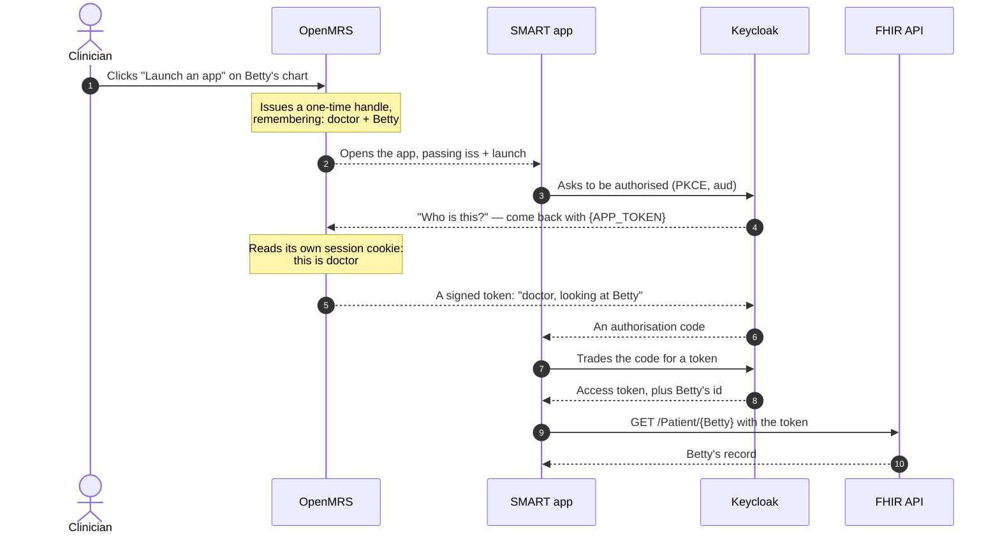
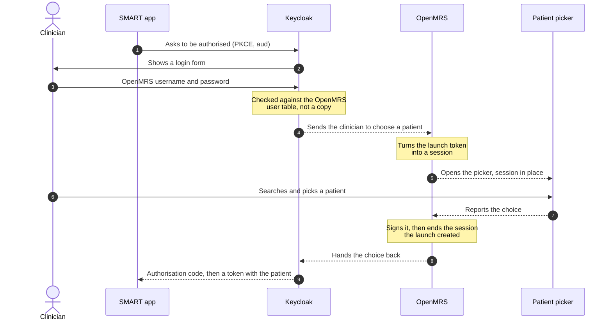

openmrs-module-smartonfhir
==========================
[](https://github.com/openmrs/openmrs-module-smartonfhir/actions/workflows/main.yml)
[](https://codecov.io/gh/openmrs/openmrs-module-smartonfhir)

Makes an OpenMRS server a [SMART App Launch](https://hl7.org/fhir/smart-app-launch/) **resource
server**. Third-party clinical apps authenticate against an external authorization server, are
granted access to one patient's record, and read it through the
[FHIR2 module](https://github.com/openmrs/openmrs-module-fhir2).

## What this module does

Four things, and nothing else:

1. **Publishes the SMART discovery document** at `<fhir base>/.well-known/smart-configuration`, so an
   app can find the authorization server and see what this deployment supports.
2. **Verifies bearer tokens** on FHIR requests and turns a valid one into an OpenMRS session for the
   duration of that single request.
3. **Carries a launch through patient selection** — it accepts the authorization server's launch
   token, establishes a session from it, and hands the clinician's choice of patient back, signed.
4. **Records which apps may be launched** from a patient chart, and starts an EHR launch against one.

**It does not issue tokens and does not hold user credentials.** Anything here that looks like
authentication is either verifying somebody else's token or converting a token this server itself
signed into a session. It also reads and writes no clinical data — every FHIR resource comes from
FHIR2.

Nothing in it is specific to any one app. Any SMART client — a risk dashboard, a growth chart, a
reporting tool — gets the same launch, the same patient selection and the same FHIR access with no
change here. If you are writing one, the discovery document tells it everything it needs; on its own
side it has to send `aud`, use PKCE with `S256`, and read launch context from the token response
rather than from the access token's claims.

### Status

| | |
|---|---|
| Standalone launch with patient selection | Works. Walked end to end in a browser. |
| EHR launch | Works. The launch endpoint issues a handle and redirects to the app; the chart affordance that calls it belongs to the frontend, not here. |
| Bearer-token access to the FHIR API | Works. Tokens verified against the authorization server's published keys. |
| Discovery document | Served, with the fields SMART 2.x requires. |
| EHR launch with encounter context | Works — the EHR names the visit and the token response carries it back as `encounter` — but not advertised, because no environment walks it. |
| Standalone launch with visit selection | Refused with `501`. Choosing a visit needs a screen, and the RefApp 2.x one went with that UI. |
| Granular (v2) scope enforcement | Not implemented. Scopes are parsed and advertised, never enforced — enforcement belongs in FHIR2's resource providers. |
| Backend Services (`client_credentials`) | Not implemented. |

## Requirements

| | | |
|---|---|---|
| OpenMRS platform | 2.8.8 | Tomcat 9, `javax.servlet` |
| Java runtime | 17 or newer | Bytecode target is 17 (`maven.compiler.release`); also built on 21 |
| fhir2 | 4.2.0 | `provided`; serves every FHIR resource |
| authentication | 2.3.0 | `provided`; owns the bearer scheme's registration |
| An authorization server | — | Must implement the SMART App Launch extensions: `aud`, PKCE S256, and launch context in the token response. Keycloak 26 with the OpenMRS SMART authenticator plugin is what this is built and tested against. |

Bundled libraries are kept to a minimum, because every jar a module packages can collide with another
module's copy. **`nimbus-jose-jwt` (9.48) is the only third-party jar the omod ships** — verified with
`mvn dependency:list`. Token verification needs it and the platform does not provide it. Everything
else, Caffeine and Lombok included, is `provided`.

## Install

```bash
mvn clean install
cp omod/target/smartonfhir-2.0.0-SNAPSHOT.omod ~/openmrs/modules/
```

Requires JDK 17 or newer to build. Then configure it — an unconfigured module starts, logs one line,
and leaves every SMART endpoint dark.

## Configuration

Three JSON files under `<application data directory>/config`, and the runtime properties that
override them. Either route works on its own, and they can be mixed — see
[Configuring from the environment instead](#configuring-from-the-environment-instead).

Everything is a runtime property. There are no configuration files of this module's own: a deployment
configures it the way it configures OpenMRS, in `openmrs-runtime.properties`, and a container needs no
volume for any of it. A misspelled property is not applied, and for the app registry it is also
reported — see *When an app does not appear* below.

### 1. `smart.issuer` and the rest — the authorization server

`smart.issuer` and `smart.audience` are both **required**. Without both, nothing is served: the
discovery document is withheld rather than answered with guesses, and tokens are refused rather than
verified against something the deployment never chose.

```properties
smart.issuer=https://keycloak.example.org/realms/openmrs
smart.audience=https://openmrs.example.org/openmrs/ws/fhir2/R4
smart.advertised.jwks.uri=https://keycloak.example.org/realms/openmrs/protocol/openid-connect/certs
smart.allowed.clock.skew.seconds=30
```

| property | meaning |
|---|---|
| `smart.issuer` | The authorization server's issuer identifier. A token whose `iss` differs is rejected. |
| `smart.audience` | This FHIR server's base URL, as an app names it in the SMART `aud` parameter. A token must carry it in `aud`. |
| `smart.jwks.uri` | Where this server fetches signing keys. Defaults to the issuer's advertised `jwks_uri`. |
| `smart.advertised.jwks.uri` | What apps are *told*, for when that differs from the above. |
| `smart.username.claim` | The claim naming the OpenMRS user. Defaults to `preferred_username`. |
| `smart.allowed.clock.skew.seconds` | Skew tolerated on `exp` and `nbf`. Defaults to 30. A value that is not a whole number is refused, and the default stands. |
| `smart.authorization.endpoint`, `smart.token.endpoint`, `smart.revocation.endpoint`, `smart.registration.endpoint`, `smart.end.session.endpoint` | Optional. Derived from the issuer using OpenID Connect's conventional paths when absent. |
| `smart.introspection.endpoint` | Optional, and never derived. Introspection needs a confidential client; advertising a derived one told every public app about an endpoint it would be refused. State it only where such a client exists. |

`smart.advertised.jwks.uri` exists for the case where the authorization server has two names: this
module fetches keys server-to-server and may use a container-internal address, while an app reads the
discovery document from outside and needs one its browser can resolve.

### 2. `smart.launch.secret` — the launch signing secret

A base64 secret shared with the authorization server, used to sign the launch tokens the two exchange.
Without a usable key no launch can complete, and the module says so rather than proceeding.

```properties
smart.launch.secret=<base64, at least 256 bits>
```

Generate one with:

```bash
openssl rand -base64 32
```

Keep it out of anything you commit. On the reference application image it is
`OMRS_EXTRA_SMART_LAUNCH_SECRET`, which is where a secret belongs rather than in a file beside the code.

### 3. The launchable apps

Which apps may be launched from a chart, and where each one's launch is sent. A launch names an app by
uuid and the address is looked up server-side; **an app this deployment has not registered cannot be
launched at all.** That is the point — the launch URL used to come from a request parameter, which made
the launch endpoint an open redirector for single-use launch handles.

Apps live in the database, not in configuration, and are managed over REST at
`/ws/rest/v1/smartapp`:

```bash
curl -u admin:Admin123 -X POST http://localhost/openmrs/ws/rest/v1/smartapp \
  -H 'Content-Type: application/json' \
  -d '{"name":"Growth Chart",
       "description":"Plots weight and height against WHO reference curves",
       "launchUrl":"https://growth.example.org/launch",
       "clientId":"growth-chart",
       "launchContext":"patient"}'
```

`name` and `launchUrl` are required. `launchContext` is `patient` (the default) or `encounter`, and a
launch asking for something else is refused. `clientId` is recorded so a deployment can tell which
Keycloak registration an app belongs to; the launch does not use it, since the app presents its own.

A registration that could not be launched is refused with `400` rather than stored — no name, no launch
URL, a launch URL that is not `http` or `https`, an unknown launch context, or a name another app
already holds. So an app never appears in a chart menu and then fails when chosen.

Reading the list needs *Get SMART Apps*; registering, editing and retiring need *Manage SMART Apps*.
`GET` with no `includeAll` omits retired apps, so retiring one takes it out of the menu while keeping
the record.

Neither privilege is granted to anything when the module installs. OpenMRS creates them on startup, but
who holds them is the deployment's decision, so on a fresh install nobody can read the registry except a
superuser, and a clinician sees no launch action at all. Grant them in the legacy admin UI under
**Administration -> Manage Roles**: open the role your clinicians hold and add *Get SMART Apps*. In the
reference application the clinical roles inherit from *Privilege Level: High*, so granting it there
reaches all of them at once rather than role by role. A user picks the change up at their next login,
since roles are read when they authenticate.

Keep *Manage SMART Apps* to whoever administers the deployment. It is what allows an app to be registered
or pointed at a different launch URL, so a role that holds it can decide where a launch is sent.

The database rather than configuration because a registry that needs a restart to change is a registry
nobody maintains: runtime properties are read once at startup, and five keys per app does not scale
past a demonstration.

### Configuring from the environment instead

Every key in the two files above that a container is likely to set has a runtime property, so a
deployment need not write JSON into a volume to say two strings. In `openmrs-runtime.properties`:

```properties
smart.issuer=https://keycloak.example.org/realms/openmrs
smart.audience=https://openmrs.example.org/openmrs/ws/fhir2/R4
smart.jwks.uri=http://keycloak:8080/realms/openmrs/protocol/openid-connect/certs
smart.advertised.jwks.uri=https://keycloak.example.org/realms/openmrs/protocol/openid-connect/certs
smart.username.claim=preferred_username
smart.launch.secret=<base64, at least 256 bits>
```

The reference application image maps environment variables onto these, so no properties file need be
edited by hand: it takes every variable named `OMRS_EXTRA_<NAME>`, drops the prefix, lower-cases the
rest and turns `_` into `.`, then turns any resulting `..` back into `_`. So `OMRS_EXTRA_SMART_ISSUER`
arrives as `smart.issuer`, and a property that genuinely contains an underscore is written `__`.

`smart.issuer` and `smart.audience` are both required. The startup log names the properties it applied,
so check there when a value is not the one you expected:

```
SMART on FHIR configured for issuer https://... and audience https://..., from smart.issuer, smart.audience, smart.advertised.jwks.uri
```

This module reads no configuration file, so there is no second place to look and no layering rule to
remember. That was not always true: the authorization server used to be `config/smart-oauth2.json` with
properties overriding individual keys, and the launch secret `config/smart-secret-key.json`. Both are
gone, along with the volume a container needed to supply them.

The launchable apps of section 3 are **not** among these. They live in the database, so registering one
is a REST call rather than a variable, and takes effect without a restart.

**A property outlives the variable that set it.** The image appends what it derives into
`{data directory}/openmrs-runtime.properties` and keeps whatever that file already had, so deleting a
variable from the environment and recreating the container leaves the property sitting on the data
volume. To remove one, delete its line from that file. This is the image's behaviour rather than the
module's.

**Changing any of these needs a restart.** OpenMRS reads the runtime properties into memory once at
startup and never re-reads the file, so no module can pick up an edit while running.

### When an app does not appear

A registration that cannot be launched is refused when it is made, so most mistakes are a `400` on the
POST rather than a silent absence:

| response | what it means |
|---|---|
| `400` *A SMART app needs a name* / *needs a launch URL* | A required field was missing or blank. |
| `400` *must be an http or https URL* | A launch URL a browser cannot be sent to. |
| `400` *is already registered* | Another app holds that name. The message says so when the holder is retired, since a retired app is absent from the list you just read. |
| `400` *launch context must be* | Something other than `patient` or `encounter`. |
| `403` on the POST | The user lacks *Manage SMART Apps*. |
| `403` on the `GET`, or no launch action in the chart | The user lacks *Get SMART Apps*. Grant it to their role under Administration -> Manage Roles; see above. |
| Registered, but the chart menu is empty | The frontend module has to be in the app shell, which is decided when the frontend image is built. |

### 4. Register the bearer scheme

In `openmrs-runtime.properties`. Without this, every FHIR request carrying a SMART token answers `401`
with nothing to say why:

```properties
authentication.scheme=smartBearer
authentication.scheme.smartBearer.type=org.openmrs.module.smartonfhir.web.smart.SmartBearerTokenAuthenticationScheme
```

The id is yours to choose. What has to match is the two keys — `authentication.scheme=<id>` and
`authentication.scheme.<id>.type` — and nothing else: `DelegatingAuthenticationScheme.authenticate()`
asks for the configured scheme with no argument, so the id inside the credentials is never used to route
and need not equal `SmartBearerCredentials.SCHEME_ID`. Lower case is the safer choice, since these two
keys can then come from `OMRS_EXTRA_*`, and they are the only authentication properties this module
needs — it asks for no whitelist, so a deployment's `authentication.whiteList` remains whatever that
deployment wants it to be.

**This makes the scheme primary for every `Context.authenticate` call in the deployment, not only for
SMART ones.** The authentication module has one scheme, chosen by that property, and does not route by
credential type — which is the only reason this module needs the slot at all. Non-SMART credentials are
passed on:

```properties
# The scheme to hand anything that is not a SMART token. Optional.
authentication.scheme.smartbearer.config.delegate=<the id of your previous scheme>
```

Unset, the delegate is a plain `UsernamePasswordAuthenticationScheme` — which is exactly what the
authentication module itself falls back to when `authentication.scheme` is blank, so a deployment that
had not configured a scheme loses nothing. **A deployment that had one must name it here**, or setting
`authentication.scheme` to this scheme silently replaces it with username and password.

None of this is required by SMART App Launch. The specification asks that the FHIR server accept a
bearer token and enforce scopes; how a token becomes an OpenMRS principal is this module's business, and
going through `Context.authenticate` is what gives a request a real `UserContext`, its privileges and its
audit trail rather than a session assembled by hand.

### Check it came up

```bash
curl -s https://openmrs.example.org/openmrs/ws/fhir2/R4/.well-known/smart-configuration | jq .
```

A `503` means the configuration was not read — check the log for the line written at startup. A `200`
should name your issuer, and its `capabilities` should list `launch-standalone`.

## Endpoints this module adds

| | |
|---|---|
| `GET <fhir base>/.well-known/smart-configuration` | The discovery document. Public. Also served directly at `/ms/smartConfig`. |
| `/ws/rest/v1/smartapp` | The registered apps, as a REST resource: `GET` the list a chart menu reads, `POST` to register, `DELETE` to retire. `GET` needs *Get SMART Apps*; writing needs *Manage SMART Apps*. The default representation omits each app's launch URL and client id. |
| `GET /ms/smartEhrLaunchServlet?appId={uuid}&patientId=[&visitId=]` | Starts an EHR launch, the app named by its uuid. Requires a session. Redirects to the app's `launchUrl` with `iss` and `launch` appended. |
| `GET /ms/smartPatientSelection?token=` | Where the authorization server sends a launch that needs a patient chosen. Authenticates from the launch token, then redirects to the picker. |
| `GET /ms/smartLaunchOptionSelected?token=&patientId=` | Records the clinician's choice, signs it, and hands back to the authorization server. |
| `GET /ms/smartAccessConfirmation?token=` | The launch-access confirmation screen, ported from 1.x. |
| filter on `/ws/fhir2*` | Verifies a `Bearer` token and authenticates the request. Also the CORS headers the FHIR API needs. |

## How a launch works

Two servers are involved, and **no step of a launch passes between them directly**. Everything a
launch carries goes through the clinician's browser as a series of redirects. Keycloak decides who the
user is and what an app may see; OpenMRS holds the patient data and vouches for who is signed in.

OpenMRS does reach the authorization server on one back channel, outside any launch: it fetches the
signing keys a bearer token is verified against, and reads the issuer's discovery document to locate
them unless `smart.jwks.uri` names them outright. A deployment that blocks that outbound connection
gets a module that refuses every bearer token.

There are two ways an app can start.

| | Starts from | Does the clinician log in? |
|---|---|---|
| **EHR launch** | A patient's chart in OpenMRS | No. They are already signed in, and OpenMRS vouches for them. |
| **Standalone launch** | The app itself, opened cold | Yes, at Keycloak, with their OpenMRS password. |

### EHR launch: from a patient's chart

The clinician is looking at Betty Williams and clicks **Launch an app**. The app opens, already
showing Betty. No password, no patient search.



Reading that in words:

**Steps 1–3. OpenMRS starts the launch.** The chart calls `/ms/smartEhrLaunchServlet`, naming the app
and the patient. The module writes down "doctor is launching this app for Betty", hands back a random
one-time **handle**, and opens the app with two things only: `iss` (which FHIR server) and `launch`
(the handle). The app is told nothing about the patient yet.

**Step 4. The app asks Keycloak for permission.** A standard OAuth2 request, plus the handle it was
given.

**Steps 5–7. Keycloak asks OpenMRS who this is.** This is the part unique to an EHR launch. Instead of
showing a login form, Keycloak sends the browser back into OpenMRS with a **blank to fill in**. The
request arrives carrying the OpenMRS session cookie, so the module already knows who is signed in. It
signs a short-lived token saying "this is doctor, and the patient is Betty", and sends the browser back
to Keycloak with it.

Keycloak checks the **signature**, not the session. Both sides hold the same secret, so a valid
signature is proof the message came from OpenMRS.

**Steps 8–10. The app gets its token.** Keycloak issues an authorisation code, the app trades it for an
access token, and the response includes Betty's id as *launch context*.

**Steps 11–12. The app reads the record** from the FHIR API, using the token as a bearer credential.

<details>
<summary>The actual HTTP trace, if you want to follow along</summary>

Six responses, captured from a running stack. Each `302` means "go here next", and the browser follows
automatically. Values are redacted; the shape is real.

```http
302 /openmrs/ms/smartEhrLaunchServlet?appId=64b26639-…&patientId=c3ab5d9b-…
302 http://localhost:3000/?iss=…%2Fws%2Ffhir2%2FR4&launch=<handle>
302 …/openid-connect/auth?client_id=smartClient&response_type=code&aud=…&code_challenge_method=S256&launch=<handle>
302 /openmrs/smartonfhir/smartAccessConfirmation?token=…%26app-token%3D%7BAPP_TOKEN%7D&launch=<handle>
302 …/realms/openmrs/login-actions/authenticate?session_code=…&app-token=<signed token>
200 http://localhost:3000/?state=…&code=<authorisation code>
```

The fourth line looks worst because it carries a whole URL inside a parameter. Decoded, it is Keycloak
saying *"send the browser back to this address, and put your token where `{APP_TOKEN}` is"*.

A step-by-step version with screenshots lives in the
[distribution repository](https://github.com/mherman22/openmrs-distro-smartonfhir/blob/main/docs/ehr-launch.md).

</details>

<details>
<summary>What the signed token contains, and the code that makes it</summary>

Decoded from a real launch:

```json
{ "alg": "HS256" }
{ "sub": "doctor", "patient": "c3ab5d9b-…", "iat": 1786648219, "exp": 1786648519 }
```

Five minutes, signed with the secret shared with Keycloak. Keycloak's side leaves the blank:

```java
// SmartLaunchAccessAuthenticator, in the Keycloak plugin
final String actionUrl = context.getActionUrl(context.generateAccessCode()).toString();
final String submitUrl = actionUrl + "&app-token={APP_TOKEN}";
```

and OpenMRS fills it:

```java
// SmartAccessConfirmation
SmartSession session = new SmartLaunchContextService()
        .redeem(launchId, SmartLaunchContextService.identify(user));   // one use, by its owner only

JWTClaimsSet.Builder claims = new JWTClaimsSet.Builder()
        .subject(SmartLaunchContextService.identify(user));            // system_id when there is no username
claims.claim(PATIENT_NAME, session.getPatientUuid());
```

`identify()` falls back to `system_id` because OpenMRS's own `admin` account has no username. Sign a
token with a null subject and the launch fails later with "names no user".

</details>

<details>
<summary>Why no login form appears, and how to make one appear</summary>

The realm's login flow tries alternatives in order and stops at the first that works:

```
SMART browser flow
  REQUIRED     smart-audience-validator          ← aud is always checked
  REQUIRED     SMART authentication
                 ALTERNATIVE  auth-cookie                   ← an existing Keycloak session
                 ALTERNATIVE  smart-access-authenticator    ← the vouching above
                 ALTERNATIVE  SMART forms  →  smart-username-password-form
```

An EHR launch carries a handle, so the second alternative handles it and the form in the third branch
is never reached. A standalone launch has no handle, that alternative steps aside, and the form runs.

To see the login form while developing, use a private window: after any launch, Keycloak leaves a
`KEYCLOAK_IDENTITY` cookie, and the first alternative then skips the form as well.

Do **not** try to force a prompt by disabling the vouching authenticator. It is the only thing that
redeems the handle, so the clinician would log in and the app would then receive no patient.

</details>

### Standalone launch: the app opened cold

Nobody is signed in, and no patient has been chosen, so both have to happen.



Two things here are less obvious than they look.

**Credentials are the clinician's own OpenMRS password.** Keycloak reads the OpenMRS user table through
a federation provider, so there is one account and one place to disable it.

**The launch cannot land on the picker's web address directly.** The O3 app shell refuses to render any
page until a session exists, and redirects to the login page instead — which throws away the launch
token in the URL. So Keycloak is pointed at a small OpenMRS endpoint that creates the session first,
then forwards to the picker.

<details>
<summary>The redirect that made this necessary</summary>

```java
// SmartPatientSelectionServlet — reached only after the filter authenticated from the token
StringBuilder target = new StringBuilder(request.getContextPath())
        .append("/spa/smart/select-patient")
        .append("?token=").append(URLEncoder.encode(token, "UTF-8"));
response.sendRedirect(target.toString());
```

Not `encodeRedirectURL`, which would append the session id to the address bar.

This bug passed a complete `curl` walk while failing in every browser, because `curl` never runs the
app shell. If a test harness cannot see a class of bug, it is not evidence.

</details>

## Reading data with the token

Once launched, the app calls the FHIR API with the access token:

```bash
curl -H "Authorization: Bearer $ACCESS_TOKEN" \
     https://openmrs.example.org/openmrs/ws/fhir2/R4/Patient/$PATIENT_ID
```

The token is proof for **one request**, not a login. The module authenticates the request, serves it,
and logs out again.

There are two different `401`s, and telling them apart saves time:

| What you sent | What comes back | Who refused |
|---|---|---|
| No `Authorization` header | `401` with an HTML body | OpenMRS itself. This module never saw the request. |
| `Authorization: Bearer <bad token>` | `401` with `WWW-Authenticate: Bearer error="invalid_token"` | This module's filter. |

<details>
<summary>What the module checks, and what a real token looks like</summary>

A real access token, decoded:

```
alg=RS256, kid=tURRzsLE7oUF…
claims: aud, azp, exp, iat, iss, jti, preferred_username, scope, sid, typ
aud   : http://localhost/openmrs/ws/fhir2/R4
scope : openid launch profile fhirUser patient/Patient.rs
preferred_username: doctor
```

`preferred_username` is what names the OpenMRS user. A token can verify perfectly and still name
nobody, so the module logs that case with the remedy.

```java
processor.setJWSKeySelector(new JWSVerificationKeySelector<>(PERMITTED_ALGORITHMS, keySource));
List<String> required = Arrays.asList("exp", "iss", "aud");
JWTClaimsSet expected = new JWTClaimsSet.Builder().issuer(config.getIssuer()).build();
DefaultJWTClaimsVerifier<SecurityContext> verifier =
        new DefaultJWTClaimsVerifier<>(config.getAudience(), expected, new HashSet<>(required));
verifier.setMaxClockSkew(config.getAllowedClockSkewSeconds());
```

- **Asymmetric signatures only.** Accepting an HMAC would mean accepting a token signed with a secret
  this module also holds.
- **`exp` is required**, not merely honoured when present.
- **`aud` is membership, not equality** (RFC 7519 §4.1.3). Keycloak issues multi-audience tokens, and
  exact matching rejected them.

</details>

> **The patient is in the token response, not in the token.** SMART 2.x hands launch context to the app
> beside the access token, so the FHIR server never sees it. The module reads a `patient` claim that
> never arrives, which is harmless today and listed under [known gaps](#known-gaps-in-this-repo).

## Other decisions worth knowing

The launch and token mechanics are above; these are the rest.
**The authentication scheme is not a Spring component.**
`Context.setAuthenticationScheme()` resolves `getBean(AuthenticationScheme.class)`, which permits
exactly one bean. Registering ours as `@Component` silently disabled the authentication module with
`Multiple authentication schemes overrides`. `webModuleApplicationContext.xml` therefore excludes
`AuthenticationScheme` from the component scan, and the scheme is registered through the authentication
module's configuration instead — `AuthenticationConfig.getAuthenticationScheme()` reads
`authentication.scheme`, then instantiates `authentication.scheme.<id>.type` reflectively and calls
`configure()` with the `…config.*` subset. Nothing in this module reads those properties.

**The scheme is deliberately not a `WebAuthenticationScheme`.**
The authentication module's filter is mapped to every URL, but it collects credentials, redirects to a
login page and consults `authentication.whiteList` only when the active scheme extends that base; for any
other scheme it passes the request straight down the chain. This scheme has no interactive login to
drive — the bearer header is read by `SmartBearerTokenFilter`, scoped to the FHIR paths. It did extend
that base once, returning no credentials and a null challenge URL on the assumption that a null
challenge URL reads as "carry on". It does not: the filter falls through to the whitelist and, for
anything not listed, calls `sendRedirect(null)`, which was measured as a redirect loop on the OpenMRS
root. That is why registering this scheme used to require `authentication.whiteList=/*` — switching the
module's gatekeeping off for the whole webapp to accommodate a scheme that never wanted it on. It now
implements `ConfigurableAuthenticationScheme`, which is all the module needs to instantiate and
configure it, and asks nothing of the whitelist. What the base class did around authentication is kept:
a SMART authentication is still reported to the login record the module logs its `AUTHENTICATION_*`
events from.

**A launch does not leave a session behind.**
A standalone launch must sign the clinician in so they can search for a patient. That session used to
outlive the launch, leaving the browser holding a privileged session no visible logout would end — on a
shared workstation, the next person's session. `SmartLaunchOptionSelected` ends it at hand-off, but only
when the bypass filter created it, identified by a marker. A clinician already signed in keeps their own
session, which predates the launch and is not the launch's to end.

**Ending it does not invalidate the session container.**
`Context.logout()` and remove the marker; do **not** call `session.invalidate()`. Invalidating leaves
the browser holding a cookie for a session that no longer exists, and OpenMRS then answers `401` with
an HTML error page to the next request presenting it — including the session endpoint the frontend
polls, which expects `200` with `authenticated: false`.

**The discovery document is a contract, not a wish list.**
`SmartConfigServlet.CAPABILITIES` lists only what has been walked end to end. `launch-standalone` and
`context-standalone-patient` were absent until the flow completed in a browser; `permission-v2` is
still absent. An app that trusts a capability we do not implement fails in a way that looks like the
app's fault.

**`end_session_endpoint` is advertised.**
Without it an app has no discoverable way to log anyone out, and ending the OpenMRS session alone leaves
the authorization server's session intact — the next launch in that browser is granted **silently, as
whoever launched last**.

**Configuration is files, not global properties.**
Read once at startup through holders. The authorization server's identity is deployment configuration,
not something to edit in a running system's settings UI.

**Signature checks are skipped only where nothing rests on the answer.**
`SmartLaunchTokens.readUnverifiedClaims` exists because the authorization server's action token is
signed with a key this module does not hold. It reads `launchType`, which only decides whether to ask
for a visit. The nested token that establishes *who the user is* is verified against the shared secret.

**User lookup runs under a proxy privilege.**
`getUserByUsername` is `@Authorized("Get Users")`, so during authentication — before anyone is
authenticated — it threw and made a real user look nonexistent. The lookup is wrapped in
`addProxyPrivilege`/`removeProxyPrivilege` with the removal in a `finally`.

**The bypass filter keeps two lists that must agree.**
Its servlet mappings decide which requests it sees; its `validUrls` init-param decides which of those
may present a launch token. A URL in only one fails silently — mapped but not valid means the token is
refused, valid but not mapped means the filter never runs. `ModuleResourcesTest` asserts they agree, and
that the filter never sits in front of the session endpoint O3 logs in through.

**`javax.servlet`, not `jakarta.servlet`.** OpenMRS 2.8.x runs on Tomcat 9. Do not "modernise" this.

## Known gaps in this repo

Listed because pretending otherwise is worse. Measured against SMART App Launch 2.2.0.

- **Scopes are granted and not enforced, and no `permission-*` capability is advertised because of it.**
  Scopes are requested, granted and returned; nothing refuses a request that exceeds them, so a launched
  app acts with the privileges of the clinician who launched it. SMART is explicit that a granted scope
  is a ceiling, so advertising `permission-patient` or `permission-user` would promise a limit that is
  not kept. Enforcement belongs in FHIR2's resource providers, which expose no supported way for another
  module to contribute an interceptor.
- **Launch context depends on the realm's flow order, which this module cannot enforce.** A launch
  establishes fresh context only if the SMART authenticator is tried before `auth-cookie`. With the
  cookie first, a second launch in one browser session is satisfied by the existing Keycloak session,
  writes no context notes, and the mapper emits what the previous launch left — so an app launched from
  patient B's chart is handed patient A. That was measured, and the fix is in the realm, which lives in
  the distribution. Nothing here can detect a realm that has been reordered.
- **Encounter context is not advertised.** An EHR launch naming a visit does return it as `encounter`,
  but no environment exercises it, and a capability nothing walks is one nobody notices breaking. A
  standalone launch asking for `launch/encounter` is refused with 501 regardless, because choosing a
  visit needs a screen that went with the RefApp 2.x UI.
- **Discovery endpoints are derived Keycloak-shaped.** `SmartConfigServlet` falls back to
  `/protocol/openid-connect/*` when the configuration does not state them. Reading the issuer's own
  discovery document is the correct answer.
- **Launch handles live in one JVM.** They are held in a per-node cache, so a clustered deployment
  needs sticky sessions or a launch can fail with "Unknown launch" after a redirect lands elsewhere.
  Sticky sessions are already required, since OpenMRS does not replicate the HTTP session either. The
  platform's cache manager is not a fix: its clustered configuration is an invalidation cache, which
  shares evictions rather than values.
- **Launch context never reaches the resource server.** The realm's context mapper sets
  `access.token.claim = true`, but implements only `OIDCAccessTokenResponseMapper`, so the access
  token carries no `patient`. Every read of it in this module is therefore null. Granular scope
  enforcement needs that fact and will have to get it another way.
- **`introspection_endpoint` is no longer advertised by default.** Introspection requires client
  authentication, and the app this project ships is a public client, which Keycloak answers `403
  {"error":"invalid_request","error_description":"Client not allowed."}`. The endpoint used to be
  derived from the issuer, so every app could discover one and none could use it. It is now advertised
  only where a deployment sets `smart.introspection.endpoint`, which is the case
  where a confidential client exists to authenticate to it. `revocation_endpoint` is still derived and
  has not been measured against a public client.
- **The launch token is decoded twice.** `SmartLaunchOptionSelected` calls `URLDecoder.decode` on a
  value the container already decoded. It is load-bearing — the `{APP_TOKEN}` placeholder only appears
  after the second pass — and preserved deliberately, because the chain is verified end to end around
  it.
- **The session-lifecycle logic has no unit test.** `Context` and `HttpSession` are static and
  container-owned; the honest coverage is at integration level. A unit test here would mostly assert
  that mocks were called.
- **The 1.x servlets were ported, not redesigned.** `SmartAccessConfirmation` and
  `SmartAppSelectorServlet` still carry 1.x assumptions.

## Testing

```bash
mvn clean install       # 90 tests: 81 in api, 9 in omod
```

`api` tests cover launch-token signing and verification, the access-token verifier's accept/reject
matrix (smuggled audiences, clock skew, missing `exp`, non-permitted algorithms), and launch-handle
entropy, single use and ownership.

`omod`'s `ModuleResourcesTest` covers what the compiler cannot: that every XML resource parses, that no
comment contains `--` (which XML forbids, and which once stopped this module and took all 31 modules of
the reference application down with it, leaving REST answering 404), that only dependencies it ships are
required, and that the bypass filter's two URL lists agree.

Two habits worth keeping when adding tests here. **A test must be able to fail** — every guard in this
repository has been mutation-checked by reintroducing the defect and watching the test fail. Two
assertions written during this work were vacuous and only found that way. And **test through a path
that can see the failure**: the standalone launch once passed a full `curl` walk while being completely
broken in every browser, because `curl` never runs the app shell.

Write tests in given/when/then order, prefer `assertThat` with a Hamcrest matcher where it reads better
than an equality assertion, and name the test after the behaviour rather than the method — a failure
should be legible without opening the file.

## Contributing

Change only what the task requires; match the surrounding style even where you would write it
differently. Remove the imports and helpers *your* change orphaned, and leave unrelated dead code alone
— mention it instead. Comments earn their place by explaining why an obvious alternative is wrong, not
by restating the code.

Every source file carries the header from [license-header.txt](license-header.txt); add it to new files
with:

```bash
mvn com.mycila:license-maven-plugin:format
```

## License

[MPL 2.0 with Healthcare Disclaimer](LICENSE).
